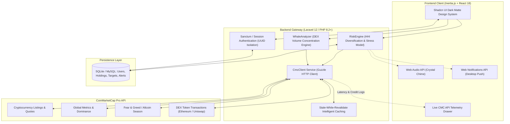

# 🔭 CryptoScope Intelligence Suite

> **Institutional-Grade Crypto Screener, DEX Tape Whale Flow Detector & Risk Engine powered by the CoinMarketCap Pro API.**  
> Built for the **Build with CMC: API Hackathon** (Track: *Markets and Trading Tools* & *Data and Visualisation*).

[](https://coinmarketcap.com/api/)
[](https://youtu.be/DR06dqpHheo)
[](https://cryptoscope.mousydev.website)
[](https://laravel.com)
[](https://inertiajs.com)
[](https://react.dev)
[](https://ui.shadcn.com)
[](LICENSE)

---

### 🎥 Video Demonstration & Pitch

<div align="center">

[](https://youtu.be/DR06dqpHheo)

▶️ **[Click here to watch the official demo on YouTube](https://youtu.be/DR06dqpHheo)** &nbsp;|&nbsp; 🌐 **[Explore the Live Production App](https://cryptoscope.mousydev.website)**

</div>

---

## 🎯 Executive Summary & The Problem

Most cryptocurrency dashboards in hackathons fall into one of two traps:
1. **Generic CEX Clones:** Simple tables re-displaying CoinMarketCap's front page without any unique quantitative layer.
2. **Disconnected Tools:** Fragmented utilities with poor UX that force traders to hop between different sites to analyze market cycles, track on-chain DEX order manipulation, evaluate portfolio concentration, and monitor take-profit levels.

**CryptoScope** solves this by unifying **6 high-value CoinMarketCap API endpoints** into an institutional, Bloomberg-inspired dark matte intelligence workstation. It turns raw market feeds into actionable risk diagnostics, on-chain whale forensic traces, and autonomous alerts with zero cognitive clutter.

---

## ⚡ Key Pillars & Capabilities

### 1. 🔍 Opportunity Screener & Sentiment Index (`/screener`)
- **Live CMC Quotes & Dynamic Metrics:** Evaluates 24h & 7d performance, 24h volume, market cap, and sparklines.
- **Sentiment & Macro Indicators:** Seamlessly embeds real-time **Fear & Greed Index** (`/v3/fear-and-greed/latest`) and the **Altcoin Season Index** (`/v1/altcoin-season-index/latest`) directly into the header stream.
- **Direct Coin Integration:** Instant search, categorical tag filtering, and 1-click modal to inspect coin mechanics or directly inject holdings into your portfolio.

### 2. 🐋 DEX Tape Whale Flow Detector (`/whale-detector`)
- **Direct On-Chain Swap Forensics:** Integrates CMC's advanced decentralized exchange transactions endpoint (`/v1/dex/tokens/transactions`) on the Ethereum network.
- **Institutional Volume Separation:** Quantifies maker concentration by analyzing top swap volume vs total block volume.
- **Frictionless Presets & Audit Tape:** Pre-configured with top DeFi tokens (`UNI`, `PEPE`, `WETH`, `LINK`, `AUSD`) with direct links to Etherscan tx hashes and maker wallet addresses.
- **Cryptographic Export:** Export parsed transaction receipts in clean JSON format for offline algorithmic compliance.

### 3. 🛡️ Quantitative Risk Portfolio Engine (`/portfolio`)
- **Herfindahl-Hirschman Index (HHI):** Mathematical diversification scoring that categorizes capital risk (*Diversificado*, *Concentración Moderada*, *Hiperconcentrado*) with actionable diversification recommendations.
- **Multi-User Private Sandboxes:** Secured via Laravel Auth, scoped to individual user accounts with cryptographic `UUID` database identifiers.
- **Autonomous Take-Profit & Stop-Loss Engine:**
  - Define custom targets in USD price or ROI percentage.
  - Periodic background polling (`/api/portfolio/check-targets`) with native browser desktop notifications and sound alerts.
- **Black Swan Stress Test Simulator:** Real-time simulated portfolio balance under custom flash crash scenarios (-5% to -80%).

### 4. 🔔 Autonomous Real-Time Alerts (`/alerts`)
- **Proactive Market Watchdog:** Set target crossover alarms (Above / Below) tied to authenticated user workspaces.
- **Auditory & Visual Synthesizer:** Emits an Apple-grade crystal chime via the Web Audio API alongside Native Web Push notifications even when the browser tab is in the background.

### 5. 🌐 Global Market Pulse (`/market-pulse`)
- **Macro Cycle Thermometer:** Deconstructs global metrics (`/v1/global-metrics/quotes/latest`), Bitcoin Dominance, Ethereum Dominance, and Altcoin capital share into interactive radial gauges and donut visualizations.
- **Liquidity Velocity & Phase Diagnosis:** Automatically detects whether the market is in *Acumulación*, *Expansión (Mark-up)*, *Euforia especulativa*, or *Distribución*.

### 6. 🔬 Live CMC Pro API Inspector (`ApiInspector.jsx`)
- **Total Transparency for Hackathon Judges:** A real-time telemetry console showing exact API credits consumed, server round-trip latency in milliseconds, HTTP response codes, and sanitized payload previews for every CMC endpoint called.

---

## 📡 CoinMarketCap API Integration Matrix

CryptoScope deeply leverages **6 distinct CoinMarketCap Pro endpoints**, demonstrating high technical versatility:

| Endpoint | HTTP Method | Tier | Role in CryptoScope |
| :--- | :---: | :---: | :--- |
| `/v1/cryptocurrency/listings/latest` | `GET` | Pro / Basic | Powers the primary Opportunity Screener with real-time volume, rankings, and market cap. |
| `/v1/cryptocurrency/quotes/latest` | `GET` | Pro / Basic | Live pricing engine for user portfolio positions and real-time alert trigger checks. |
| `/v1/global-metrics/quotes/latest` | `GET` | Pro / Basic | Feeds the Global Market Pulse: Total Market Cap, 24h Volume, BTC/ETH Dominance. |
| `/v3/fear-and-greed/latest` | `GET` | Public / Pro | Powers the macro sentiment gauge displayed on the screener header. |
| `/v1/altcoin-season-index/latest` | `GET` | Public / Pro | Computes the 90-day Altcoin cycle index to diagnose capital rotation from Bitcoin. |
| `/v1/dex/tokens/transactions` | `GET` | DEX Tier | **DEX Whale Tape**: Retrieves on-chain swaps on Ethereum to compute whale volume concentration. |

---

## 🏗️ System Architecture



---

## 💡 What CMC Made Possible & Challenges Overcome

### What the CoinMarketCap API Made Possible:
- **Bridging CEX and DEX in a Single Dashboard:** Traditional tools require separate APIs for centralized exchange data and decentralized pools. CMC's unified data ontology allowed us to seamlessly transition from macro market caps to granular Ethereum Uniswap transaction tapes without data schema mismatch.
- **Accurate Historical Sparklines & Media Assets:** Instant access to verified 64x64 vector coin icons and 7-day sparkline SVGs via CMC's high-performance CDN.

### Challenges Encountered & How We Solved Them:
1. **Zero-Trust Client Security & CORS:** Direct browser calls to `pro-api.coinmarketcap.com` fail due to browser CORS policies and leak private API keys.  
   *Solution:* We engineered a server-side proxy architecture via Laravel's `CmcClient` service with strict input sanitization.
2. **API Credit Preservation (Hackathon Quotas):** High-frequency trading UI refreshes can burn credits quickly.  
   *Solution:* We designed a multi-tier cache (`60s` for listings, `30s` for quotes, `120s` for global metrics) with an automatic stale-while-revalidate fallback mechanism.
3. **DEX Payload Normalization:** DEX swap transaction feeds use abbreviated keys (`tp`, `ma`, `v`, `tx`, `ts`).  
   *Solution:* We developed `WhaleAnalyzer.php` to parse and normalize DEX transaction tapes into human-readable Maker wallets, Etherscan explorer links, and buy/sell pressure ratios.

---

## 🚀 Quickstart & Local Setup

### Prerequisites
- **PHP** >= 8.2
- **Composer** 2.x
- **Node.js** >= 18.x & **NPM**
- A **CoinMarketCap Pro API Key** ([Get your free API key here](https://coinmarketcap.com/api/))

### Installation Steps

1. **Clone the repository:**
   ```bash
   git clone https://github.com/brad-basilio/cryptoscope.git
   cd cryptoscope/cryptoscope-laravel
   ```

2. **Install backend & frontend dependencies:**
   ```bash
   composer install
   npm install
   ```

3. **Configure Environment Variables:**
   ```bash
   cp .env.example .env
   php artisan key:generate
   ```

4. **Add your CoinMarketCap API Key in `.env`:**
   ```env
   CMC_API_KEY=your_coinmarketcap_pro_api_key_here
   ```

5. **Run Migrations & Seeders:**
   ```bash
   php artisan migrate --seed
   ```
   > This initializes the SQLite database and seeds the default **Super Admin** credential:
   > - **Email:** `admin@cryptoscope.mousydev.website`
   > - **Password:** `Admin2026!CryptoScope`

6. **Build assets & Start server:**
   ```bash
   # Terminal 1: Build & Watch Frontend
   npm run dev

   # Terminal 2: Start Laravel Server
   php artisan serve
   ```

7. Open your browser and navigate to:
   ```
   http://127.0.0.1:8000
   ```
   *Producción Oficial:* [https://cryptoscope.mousydev.website](https://cryptoscope.mousydev.website)

---

## 🧪 Verifying Live CoinMarketCap API Calls

To verify that live API data is flowing from CoinMarketCap:
1. Open CryptoScope in your browser.
2. Click on the **"API Inspector"** button located in the top navigation bar or floating footer.
3. The drawer will show live call logs, execution times (e.g. `~180ms`), HTTP 200 OK status codes, and exact endpoint URIs consumed.

---

## 🔒 Security & Privacy

- **UUID Isolation:** All portfolio holdings, take-profit rules, and price alerts are indexed with `UUID` v4 identifiers and strictly scoped by authenticated `user_id`.
- **Credential Protection:** API keys reside exclusively in backend environment variables and are never transmitted to client browsers.
- **Zero Third-Party Trackers:** No third-party analytical cookies or external data harvesters.

---

## 🏆 Hackathon Metadata

- **Event:** [Build with CMC: API Hackathon](https://coinmarketcap.com/api/resources/api-hackathon/) (Sept 9 – Sept 30, 2026)
- **Primary Track:** *Markets and Trading Tools*
- **Secondary Track:** *Data and Visualisation*
- **License:** [MIT](LICENSE)
